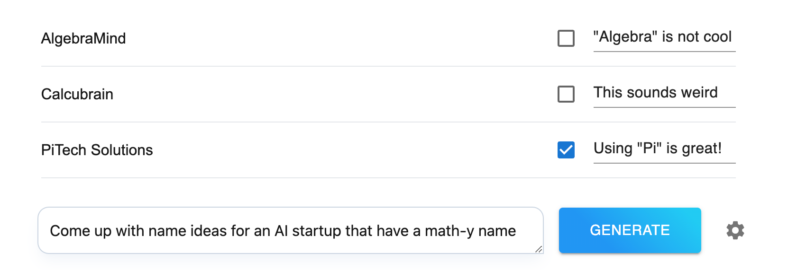

  

## Try it out (free)

Sign up [here](https://www.rayos.ai/sign-in) to get started!

## How it works

- When you click "Generate" your prompt (with some automatic additions) is sent to one of OpenAI's latest models (gpt-4o-mini or gpt-4o).
- The prompt additions are just the previously generated ideas, whether each one was marked as "good" or not, and the feedback for each one if any is given (not required).
- You can choose the model to use, and the number of ideas to generate in the settings
  - We use [structured outputs](https://openai.com/index/introducing-structured-outputs-in-the-api/) to help ensure that OpenAI's models respond with a list of the right number of ideas (which is why only two of OpenAI's models are available, because not all of their models have structured outputs).

## Tech stack

This project uses Next.js, Typescript, and Tailwind and is deployed on Vercel. For user authentication and database management, it uses Supabase. For the LLM, we use the OpenAI API with structured outputs.
